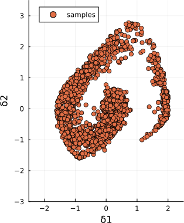

# SlicedDistributions.jl


[](https://codecov.io/gh/FriesischScott/SlicedDistributions.jl)
[](https://doi.org/10.5281/zenodo.15095609)

A julia package for robust estimation and sampling of sliced distributions [1, 2]

Sliced distributions enable the characterization of, possibly dependent, multivariate data by injecting the physical space into a higher dimensional feature space using a polynomial mapping. *SlicedDistributions* implements:

- Sliced-Normals
- Sliced-Exponentials
- sampling from the sliced distributions using transitional markov chain Monte Carlo (TMCMC)

The distributions are fully compliant with the [*Distributions.jl*](https://github.com/JuliaStats/Distributions.jl) interface of a `ContinuousMultivariateDistribution`.

Note, that the sliced-Normals are estimated by choosing a square polynomial basis and restricting the decision space of the sliced-Exponentials, see [2, Section VII].

## Example

Consider a data sequence obtained from the time-response of the Van-der-Pol oscillator.


To begin fitting a sliced distribution to the data we start by loading the necessary packages and read the input data.

```julia
using DelimitedFiles
using SlicedDistributions

δ = readdlm("demo/data/vanderpol.csv", ',')
```

Next, we define the additional input parameters and estimate a `SlicedNormal` distribution from the data. The data points are expected to be the columns of the input matrix.

```julia
d = 3 # maximum degree of the polynomial mapping into the feature space
b = 10000 # the number of samples used to estimate the normalizing constant

# the (optional) support of the sliced distribution given as lower and upper bounds of a hypercube
lb = [-2.5, -3]
ub = [2.5, 3.5]

sn, lh = SlicedNormal(δ, d, b, lb, ub)
```

If the support is omitted, the minimum and maximum values of the data will be inferred as the support automatically. To estimate a sliced-exponential distribution simply replace `SlicedNormal` with `SlicedExponential`. The next plot presents the probability density function (PDF) of the estimated distribution.


With the distribution in place we can obtain 2000 random samples through `rand`.

```julia
samples = rand(sn, 2000)
```

Internally this will use TMCMC to sample from the PDF. See the next Figure for a scatter plot of the samples.



## References

[1] L. G. Crespo, B. K. Colbert, S. P. Kenny, and D. P. Giesy, ‘On the quantification of aleatory and epistemic uncertainty using Sliced-Normal distributions’, Systems & Control Letters, vol. 134, p. 104560, Dec. 2019, doi: [10.1016/j.sysconle.2019.104560](https://doi.org/10.1016/j.sysconle.2019.104560).

[2] L. G. Crespo, B. K. Colbert, T. Slager, and S. P. Kenny, ‘Robust Estimation of Sliced-Exponential Distributions’, in 2021 60th IEEE Conference on Decision and Control (CDC), Austin, TX, USA: IEEE, Dec. 2021, pp. 6742–6748. doi: [10.1109/CDC45484.2021.9683584](https://doi.org/10.1109/CDC45484.2021.9683584).
